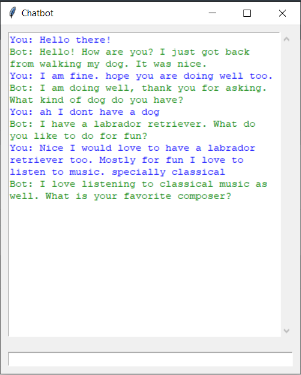

# Chatbot



### Since the development is still in progress use the following command to run the application
```bash
python chatbot_gui.py
```


### Setting up the environment
```bash
pip install -r requirements.txt
```
If this installation fails, setup the requirements manually

```bash
pip install tokenizers
pip install transformers
```

### Intalling the service
```bash
python chatbot_service.py install
```
```bash
python chatbot_service.py start
```
